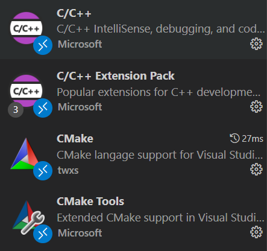
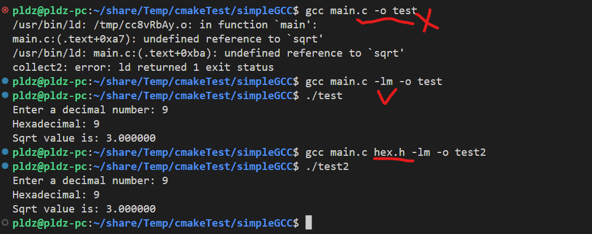
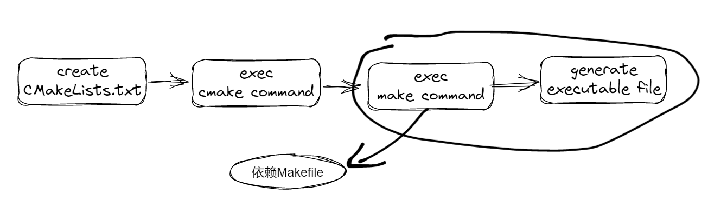
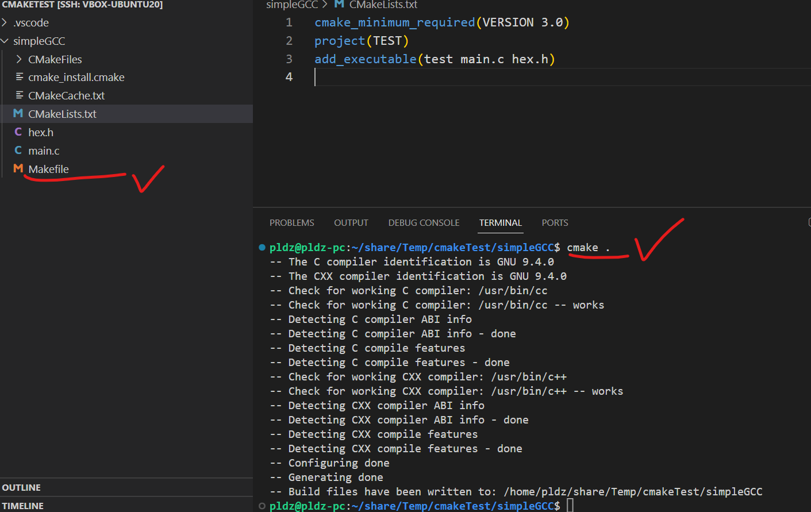
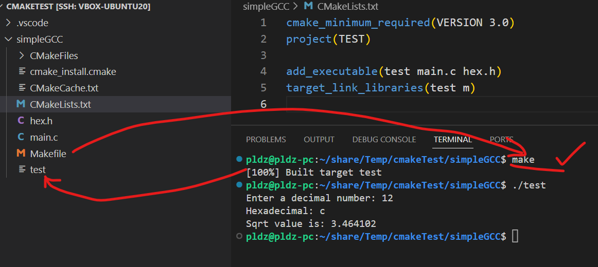

# 1. 快速体验 VSCode 和 CMake 创建 C/C++项目

> 此次介绍的内容都是针对于 `Linux` 操作系统上的开发过程.

## 1.1 安装开发工具

1. `VSCode`: 自行下载安装, 然后安装插件



2. `Cmake`:在 Ubuntu 系统上, 可以采用 apt 工具安装：`sudo apt-get install cmake`, 查看安装的版本`cmake --version`, 如下所示

```shell
pldz@pldz-pc:~/share/Temp/cmakeTest$ cmake --version
cmake version 3.16.3

CMake suite maintained and supported by Kitware (kitware.com/cmake).
```

3. 安装 GCC:例如采用命令行：`sudo apt-get install gcc`, 查看版本: `gcc -v`.

## 1.2 GCC/G++ 编译编译小型 C/C++项目

> 简单起两个文件，一个 mian.c 文件用于作为程序主入口，一个 hex.h 函数作为程序的一个外部头文件，简单实现将十进制的数转为十六进制的字符串

1. 准备一个.h 文件，如 hex.h

```c
#include <stdlib.h>
#include <stdio.h>

char *int2hex(int decimal)
{
    // 1. 静态变量来存储结果，否则函数返回时，局部数组的内存会被释放.
    static char hex[10];

    // 2. 也可以采用动态的内存.
    // char *hex = (char *)malloc(10 * sizeof(char));
    // if (hex == NULL)
    // {
    //     printf("Failed to allocate memory\n");
    //     exit(1);
    // }

    sprintf(hex, "%x", decimal);
    return hex;
}

```

2. 准备的 main.c 文件:

```c
#include <math.h>
#include "hex.h"

int main()
{
    // 1. 测试十进制和十六进制
    int decimal;
    char *hex;
    printf("Enter a decimal number: ");
    scanf("%d", &decimal);
    hex = int2hex(decimal);
    printf("Hexadecimal: %s\n", hex);
    int d = sqrt(decimal);

    // 测试math.h的引入动态库,sqrt参数实际上是double类型的,这里使用int类型也是可以的.
    printf("Sqrt value is: %lf\n", sqrt(decimal));
    return 0;
}

```

3. 直接采用 gcc 编译：`gcc main.c -lm -o test`, 或者是`gcc main.c hex.h -lm -o test`



4. 做个总结：

- 1. GCC 编译器的起始入口是 `main` 函数, 它会找到 `main` 函数的入口, 然后再当前目录下找它依赖的头文件.

- 2. 在编译时，如果需要链接动态库，`-lm`需要拆开理解，其中 `-l` 参数指定需要链接的库, `m` 表示数学库 libm.so.

- 3. gcc 命令中的 `-o` 后面的参数表示生成的可执行文件的名称，`-o`同样也可以生成动态库.

  - 创建一个 hex.c 文件，里面声明 hex.h 的函数，但是不使用：

```c
#include "hex.h"

char *int2hex(int decimal);
```

- 编译成动态库： `gcc hex.c hex.h -Wall -fPIC -shared -o test.so`, 即可生成 so 动态库，其中的 `-Wall` 参数表示开启所有警告信息，编译器会显示所有可能的警告, `-fPIC` 参数表示生成位置无关代码，这是为了生成共享库（`.so`文件）必需的, `-shared` 参数指定生成共享库（`.so` 文件）而不是可执行文件.

- 查看动态库的函数命令 `nm -D <动态库名称>`：`nm -D test.so`

```shell
pldz@pldz-pc:~/share/Temp/cmakeTest/simpleGCC$ nm -D test.so
                 w __cxa_finalize
                 w __gmon_start__
00000000000011b9 T int2hex
                 U __isoc99_scanf
                 w _ITM_deregisterTMCloneTable
                 w _ITM_registerTMCloneTable
00000000000011ee T main
                 U printf
                 U sprintf
                 U sqrt
                 U __stack_chk_fail
```

## 1.3 CMake 编译 C/C++程序流程

> C/C++教材经常提到的 C 代码的实现过程, 就是从源码 `.c` 然后经过编译生成 `.obj` 文件, 然后再链接生成可执行的文件 `.exe`.
> CMake 的操作流程也是类似，只不过，需要初始化为 CMake 工程, 然后 `1.项目源码 -> 2.CMakeLists.txt-> 3.执行cmake命令 -> 4.生成Makefile -> 5.make指令-> 6.生成执行文件`



1. 创建`CMakeLists.txt`文件.

2. 写入以下内容到`CMakeLists.txt`文件:

```cmake
cmake_minimum_required(VERSION 3.0)
project(TEST)

add_executable(test main.c hex.h)
target_link_libraries(test m)

```

> 注意，在老版本的 CMake 工具上，如果目标文件是 test，可能会提示是无效的
>
> ```shell
> CMake Error at CMakeLists.txt:4 (add_executable):
> The target name "test" is reserved or not valid for certain CMake features,
> such as generator expressions, and may result in undefined behavior.
> ```
>
> 此时可以把目标文件的名称从`test` 改为`my_test`

此时的文件结构：

```shell
pldz@pldz-pc:~/share/Temp/cmakeTest/simpleGCC$ tree
.
├── CMakeLists.txt
├── hex.h
└── main.c
```

1. 执行`cmake .`指令，创建出`Makefile`.



4. 执行`make`指令，生成可执行文件`test`


