# 2. CMake 语法的基本指令

> 主要介绍 `CMake` 脚本语言的一些基础语法怎么使用, 这个行为就像学习 `C/C++`编程语言一样, 从变量, 字符串, 列表这些基础的数据类型, 然后一步步延伸到 `if/else`, `for` 等这类的基本逻辑函数,了解 `CMake` 脚本的基本语法.
>
> [CMake 官网对指令的划分](https://cmake.org/cmake/help/latest/manual/cmake-commands.7.html)
>
> 我希望带大家一起了解的内容如下图所示，从这些基本的指令使用方法开始，了解 CMake 这个工具，也为了方便进行 CMake 的其他知识学习！

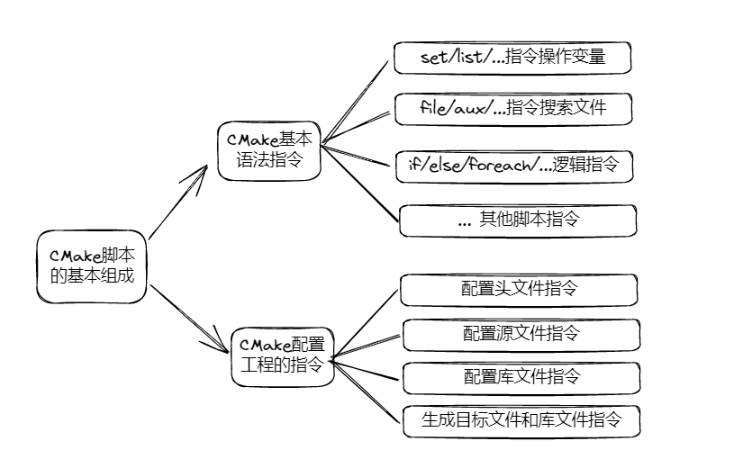

## 2.1 最小 CMakeLists.txt 文件包含的内容

1. 举个例子之前的最小的 CMake 工程就只包括两个内容`main.c`和它的头文件`hex.h`, 以及一个`math.h`的动态库`libm.so`, 整个的文件结构如下所示：

```shell
.
├── hex.h
└── main.c
```

2. 此时的最小构建的 `CMakeLists.txt` 文件就包括这些内容:

```cmake
cmake_minimum_required(VERSION 3.0)
project(TEST)

add_executable(test main.c hex.h)
target_link_libraries(test m)
```

3. 依次解读这几个指令:

- `cmake_minimum_required(最小版本号)`: 指定了 CMake 的最低版本要求;

- `project(项目名)`: 定义了项目的名称;

- `add_executable(可执行程序名 源文件名称)`: 这行命令用于添加一个**可执行文件的构建目标**; `add_executable(test main.c hex.h)`在这个例子中, 它会编译名为`"test"`的可执行文件, 并将 `main.c` 和 `hex.h` 作为源代码文件, `CMake` 会自动根据这些源文件来生成构建规则;

- `target_link_libraries(可执行程序名 动态库名称)`: 这行命令用于指定构建目标的链接库; `target_link_libraries(test m)`表示`"test"`可执行文件需要链接动态数学库`m`(`libm.so`);

> **动态库的名称均是形如`libxxx.so`由`lib`开头, `.so`结尾, 其中的`xxx`便是动态库的名称了.**

4. `CMakeLists.txt`每一行的顺序排列是有一定规则的：`cmake_minimum_required` 通常是在 CMakeLists.txt 文件的开头, 用于指定 CMake 最低版本要求, 这样做可以确保构建系统在运行时具有所需的 CMake 版本; `project` 命令通常紧跟在 `cmake_minimum_required` 之后, 用于定义项目的名称和相关属性, 这样做可以在后续的构建规则中使用项目的属性; `add_executable` 命令用于添加构建目标, 并定义源代码文件, 它通常紧跟在 `project` 命令之后, 以便在项目中创建可执行文; `target_link_libraries` 命令用于指定链接库, 它位于构建目标指令`add_executable`之后, 以确保在构建可执行文件之前已经定义了所需的链接库.

## 2.2 CMake 的预定义宏和输出命令

> 为了方便了解 CMakeLists.txt 中,一些变量的结果,因此我们先提前介绍一下 CMake 中的宏和它的输出指令的用法

### 2.2.1 CMake 的输出 message 指令

1. `message`指令：用于在构建过程中输出自定义的消息或变量的值, 语法如下：`message([<mode>] "message_text" ...)`,其中,mode 是可选参数,指定消息的类型, `message_text`是要输出的消息文本,可以包含变量、表达式和字符串.(在 CMake 指南中 **`[]`间的内容都是可选内容**)

2. 常用的 mode 有以下几种：

- `STATUS`：将消息输出为构建过程中的状态信息,通常用于显示一些进度或提示信息.
- `WARNING`：将消息输出为警告信息,通常用于显示一些警告或注意事项.
- `AUTHOR_WARNING`：将消息输出为作者警告信息,通常用于显示一些重要的警告信息.
- `SEND_ERROR`：将消息输出为错误信息,并终止构建过程.
- `FATAL_ERROR`：将消息输出为致命错误信息,并终止构建过程.

3. `message`指令示例：

```cmake
message("Hello, CMake!") # 输出普通消息

set(variable "world")
message("Hello, ${variable}!") # 输出包含变量的消息

message(STATUS "This is a status message") # 输出状态信息

message(WARNING "This is a warning") # 输出警告信息

message(FATAL_ERROR "This is a fatal error") # 输出致命错误并终止构建过程
```

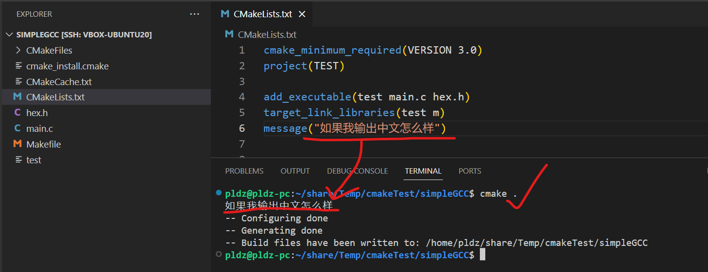

### 2.2.2 CMake 的预定义宏

1. CMake 预定义的宏是在 CMake 构建系统中预先定义的一些宏变量, 它们提供了有关**构建环境和选项的信息**, 用于指定源代码文件、目标输出路径、编译选项等, 预定义宏变量在 CMake 中是只读的,不能修改其值.

2. 常用的 CMake 预定义宏：

- `CMAKE_SOURCE_DIR`：表示`CMakeLists.txt`所在的顶级源代码目录的路径.

- `CMAKE_BINARY_DIR`：表示当前构建目录（编译目录）的路径.

- `CMAKE_CURRENT_SOURCE_DIR`：表示当前处理的`CMakeLists.txt`所在的源代码目录的路径.

- `CMAKE_CURRENT_BINARY_DIR`：表示当前处理的`CMakeLists.txt`所在的构建目录的路径.

- `CMAKE_CURRENT_LIST_DIR`：表示当前处理的`CMakeLists.txt`文件所在的完整路径.

- `CMAKE_MODULE_PATH`：表示用于查找 CMake 模块文件的路径,可以将自定义的模块文件放置在该路径下.

- `CMAKE_C_COMPILER` 和 `CMAKE_CXX_COMPILER`：表示用于编译 C 和 C++代码的编译器路径.

- `CMAKE_C_FLAGS `和 `CMAKE_CXX_FLAGS`：表示编译 C 和 C++代码时使用的编译选项.

3. 打印 CMake 预定义宏,观察结果:

```
cmake_minimum_required(VERSION 3.0)
project(TEST)

# 打印每个预定义宏的值
message("CMAKE_SOURCE_DIR: ${CMAKE_SOURCE_DIR}")
message("CMAKE_BINARY_DIR: ${CMAKE_BINARY_DIR}")
message("CMAKE_CURRENT_SOURCE_DIR: ${CMAKE_CURRENT_SOURCE_DIR}")
message("CMAKE_CURRENT_BINARY_DIR: ${CMAKE_CURRENT_BINARY_DIR}")
message("CMAKE_CURRENT_LIST_DIR: ${CMAKE_CURRENT_LIST_DIR}")
message("CMAKE_MODULE_PATH: ${CMAKE_MODULE_PATH}")
message("CMAKE_C_COMPILER: ${CMAKE_C_COMPILER}")
message("CMAKE_CXX_COMPILER: ${CMAKE_CXX_COMPILER}")
message("CMAKE_C_FLAGS: ${CMAKE_C_FLAGS}")
message("CMAKE_CXX_FLAGS: ${CMAKE_CXX_FLAGS}")
```

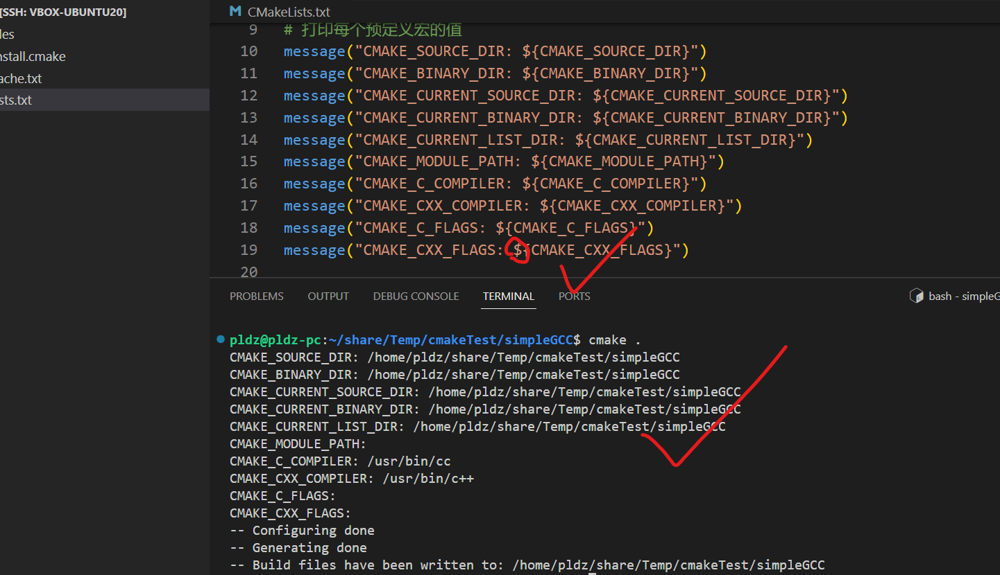

## 2.3 CMake 的变量

> 就行一门编程语言一样,之前的函数和输出指令就像学习 C/C++的 print 和`#include<stdio.h>`一样,同样 CMake 也具有变量的概念,方便用户操作这些变量,完成对项目的编译.

### 2.3.1 定义变量 set 指令

1. `set` 指令用于定义变量, 语法如下：`set(<variable> <value> [CACHE <type> <docstring> [FORCE]])`

- `<variable>`：变量名,可以是任意有效的变量名.
- `<value>`：变量的值,可以是一个字符串、路径、列表、布尔值等.
- `CACHE <type> <docstring> [FORCE]`：可选参数,用于定义一个缓存变量. 缓存变量可以在命令行或 `CMake GUI` 中修改; `<type>`指定变量的类型; `<docstring>`为变量提供一个描述性字符串; `FORCE` 选项可用于强制设置缓存变量的值.

```cmake
cmake_minimum_required(VERSION 3.0)
project(TEST)

# 定义一个普通变量
set(MY_VARIABLE "Hello, CMake!")

# 定义一个路径变量
set(MY_PATH /path/to/some/directory)

# 定义一个列表变量
set(MY_LIST item1 item2 item3)

# 定义一个布尔变量
set(MY_FLAG TRUE)

# 使用 message 指令输出变量的值
message("MY_VARIABLE: ${MY_VARIABLE}")
message("MY_PATH: ${MY_PATH}")
message("MY_LIST: ${MY_LIST}")
message("MY_FLAG: ${MY_FLAG}")
```

### 2.3.2 字符串变量值的增加操作

1. `set`指令进行字符串变量的拼接：`set(<variable> "${<variable>} <string>")` 在原有字符串变量的基础上拼接新字符串;

```
set(MY_STRING "Hello")
set(MY_STRING "${MY_STRING} CMake!")
```

### 2.3.3 路径变量值的增加操作

在 CMake 中可以使用`set`指令和`file`指令实现对路径变量的增加

1. set 指令进行路径变量的拼接：`set(<variable> "<path1>/<path2>")`形式直接将两个路径拼接在一起.

```cmake
set(MY_PATH "/path/to/some/directory")
set(MY_PATH "${MY_PATH}/subdirectory")
```

2. 举例:

```cmake
cmake_minimum_required(VERSION 3.0)
project(TEST)

# 使用 set 指令进行路径变量的拼接
set(MY_PATH_ORIGIN ${CMAKE_SOURCE_DIR})
set(MY_PATH_TEST "${MY_PATH_ORIGIN}/subdirectory")
set(MY_PATH_SRC ${MY_PATH_ORIGIN}/src)

# 使用 message 指令输出结果
message("MY_PATH_TEST: ${MY_PATH_TEST}")
message("MY_PATH_SRC: " ${MY_PATH_SRC})
```

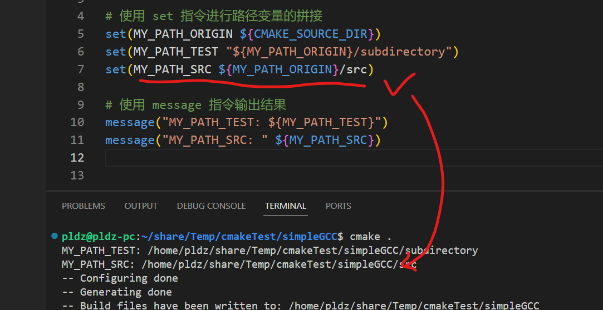

### 2.3.4 列表变量值的增加操作

在 CMake 中,可以使用 `set` 和 `list` 命令对列表变量进行增加操作.

1. 使用 `set` 命令对变量进行增加操作：

- `set(<variable> <value>)` 语法来设置一个变量的值。如果该变量已经存在,它的值将被覆盖;
- `set(<variable> ${<variable>} <value>)` 形式来在原有值的基础上追加新值;

```cmake
set(MY_LIST item1 item2) # 设置一个列表变量
set(MY_LIST ${MY_LIST} item3) # 在原有列表变量的基础上追加新元素
```

2. 使用 `list` 命令对变量进行增加操作：

- `list(APPEND <variable> <value1> [<value2> ...])` 向列表变量中追加一个或多个新值.

```cmake
set(MY_LIST item1 item2) # 设置一个列表变量
list(APPEND MY_LIST item3) # 向列表变量中追加新元素
```

3. 示例

```cmake
cmake_minimum_required(VERSION 3.0)
project(TEST)

add_executable(test main.c hex.h)
target_link_libraries(test m)
cmake_minimum_required(VERSION 3.0)
project(TEST)

# 设置变量
set(MY_LIST item1 item2)
set(MY_LIST ${MY_LIST} item3)
# 使用 message 函数输出结果
message("MY_LIST: ${MY_LIST}")

# 使用 list 命令对变量进行增加操作
set(MY_OTHER_LIST itemA itemB)
list(APPEND MY_OTHER_LIST itemC)
# 使用 message 函数输出结果
message("MY_OTHER_LIST: ${MY_OTHER_LIST}")
```

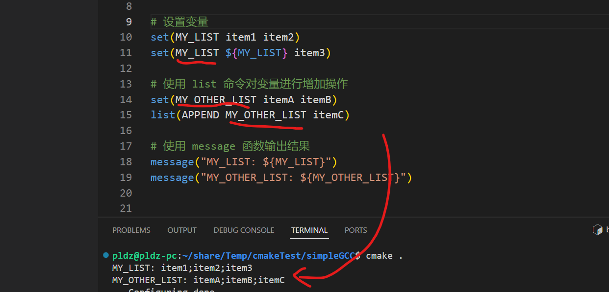

### 2.3.5 路径变量回到上一级

在 CMake 中,使用`get_filename_component`函数结合`DIRECTORY`选项来实现: `get_filename_component(<variable> ${<variable>} DIRECTORY)`

```cmake
cmake_minimum_required(VERSION 3.0)
project(TEST)

set(MY_PATH "${CMAKE_SOURCE_DIR}")

get_filename_component(MY_PARENT_DIR ${MY_PATH} DIRECTORY)

message("MY_PARENT_DIR: ${MY_PARENT_DIR}")
```

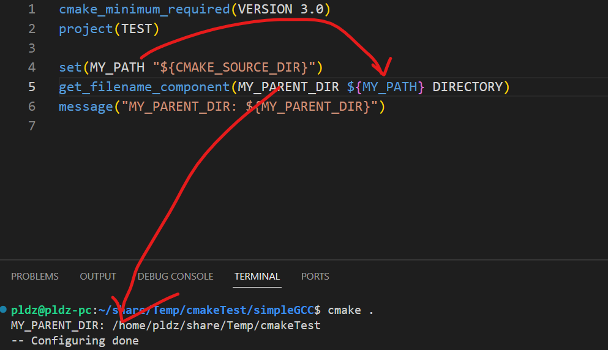

### 2.3.6 列表变量删除元素

使用`list(REMOVE_ITEM <variable> <value>)`命令来删除一个列表中的元素。该命令将从列表中删除**指定的元素**

```cmake
cmake_minimum_required(VERSION 3.0)
project(TEST)

# 定义一个包含元素的列表
set(MY_LIST "apple" "banana" "orange" "grape")

# 输出原始列表
message("Original list: ${MY_LIST}")

# 删除元素
list(REMOVE_ITEM MY_LIST "banana")

# 输出修改后的列表
message("Modified list: ${MY_LIST}")
```

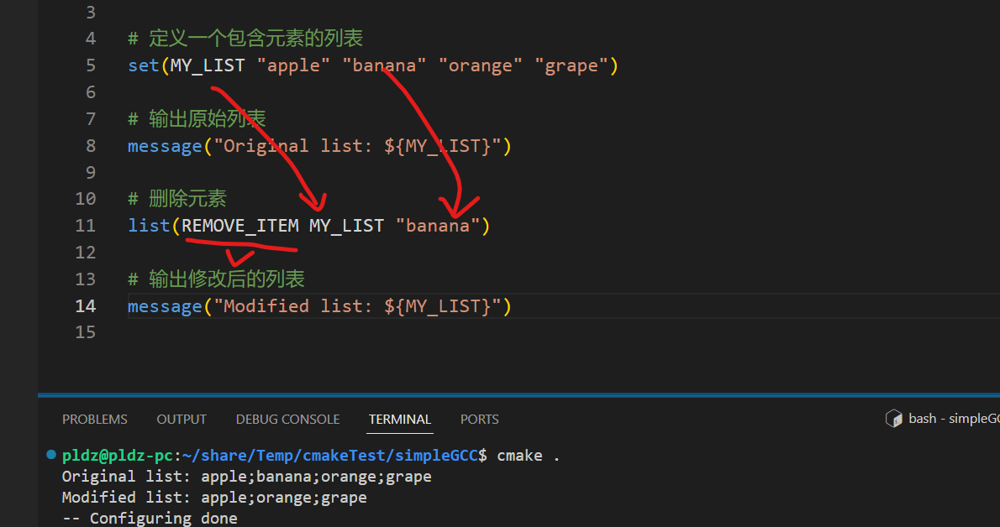

## 2.4 CMake 文件操作

> CMake 主要是对 C/C++项目进行管理, 因此它最需要的是具有对文件的操作能力，例如读取到项目中的.c/.cpp/.h/.hpp/.xxx 文件; 或者是重命名等，这里重点还是介绍搜索文件的能力.

### 2.4.1 file 指令

`file`指令的用法示例:

```shell
Reading
  file(READ <filename> <out-var> [...])
  file(STRINGS <filename> <out-var> [...])
  file(<HASH> <filename> <out-var>)
  file(TIMESTAMP <filename> <out-var> [...])
  file(GET_RUNTIME_DEPENDENCIES [...])

Writing
  file({WRITE | APPEND} <filename> <content>...)
  file({TOUCH | TOUCH_NOCREATE} [<file>...])
  file(GENERATE OUTPUT <output-file> [...])
  file(CONFIGURE OUTPUT <output-file> CONTENT <content> [...])

Filesystem
  file({GLOB | GLOB_RECURSE} <out-var> [...] [<globbing-expr>...])
  file(MAKE_DIRECTORY [<dir>...])
  file({REMOVE | REMOVE_RECURSE } [<files>...])
  file(RENAME <oldname> <newname> [...])
  file(COPY_FILE <oldname> <newname> [...])
  file({COPY | INSTALL} <file>... DESTINATION <dir> [...])
  file(SIZE <filename> <out-var>)
  file(READ_SYMLINK <linkname> <out-var>)
  file(CREATE_LINK <original> <linkname> [...])
  file(CHMOD <files>... <directories>... PERMISSIONS <permissions>... [...])
  file(CHMOD_RECURSE <files>... <directories>... PERMISSIONS <permissions>... [...])

Path Conversion
  file(REAL_PATH <path> <out-var> [BASE_DIRECTORY <dir>] [EXPAND_TILDE])
  file(RELATIVE_PATH <out-var> <directory> <file>)
  file({TO_CMAKE_PATH | TO_NATIVE_PATH} <path> <out-var>)

Transfer
  file(DOWNLOAD <url> [<file>] [...])
  file(UPLOAD <file> <url> [...])

Locking
  file(LOCK <path> [...])

Archiving
  file(ARCHIVE_CREATE OUTPUT <archive> PATHS <paths>... [...])
  file(ARCHIVE_EXTRACT INPUT <archive> [...])
```

1. 复制文件：`file(COPY ...)`: 做个了解.

2. 删除文件: `file(REMOVE ...)`: 做个了解.

3. 创建目录: `file(MAKE_DIRECTORY ...)`: 做个了解

4. 获取指定文件夹下的文件并存入变量: `file(GLOB <variable> ...)`: 将指定目录下的搜索文件存储到一个变量中，其中匹配的规则可以是通配符模式，也可以采用正则表达式.

5. 遍历获取文件并存入变量: `file(GLOB_RECURSE <variable> ...)`: 遍历某个文件夹下的文件，将搜索文件存储到一个变量中.

```cmake
cmake_minimum_required(VERSION 3.0)
project(TEST)

file(GLOB CMAKE_DIR_FILES ${CMAKE_SOURCE_DIR}/CMakeFiles/*.cmake)
message("RESULT: ${CMAKE_DIR_FILES}")

file(GLOB_RECURSE CMAKE_DEEP_FILES ${CMAKE_SOURCE_DIR}/CMakeFiles/*.cmake)
message("RESULT: ${CMAKE_DEEP_FILES}")
```

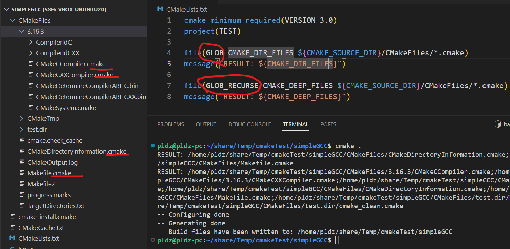

### 2.4.2 其他指令

> `aux_source_directory`在官网中划分为 CMake 的`project commands`.
> [官方 aux_source_directory 指导](https://cmake.org/cmake/help/latest/command/aux_source_directory.html)

`aux_source_directory`: 相当于搜索目录下的源文件，这个源文件的类型是.c/.cpp/.h/.hpp 或者是其他的脚本语言的后缀, 如果目录下没有这些脚本文件，则为空.

```cmake
cmake_minimum_required(VERSION 3.0)
project(TEST)

aux_source_directory(${CMAKE_SOURCE_DIR}/CMakeFiles CMAK_NOT_NOW_FILES)
message("CMakeFiles RESULT: ${CMAK_NOT_NOW_FILES}")

aux_source_directory(${CMAKE_SOURCE_DIR} CMAKE_NOW_FILES)
message("NOW RESULT: ${CMAKE_NOW_FILES}")

```

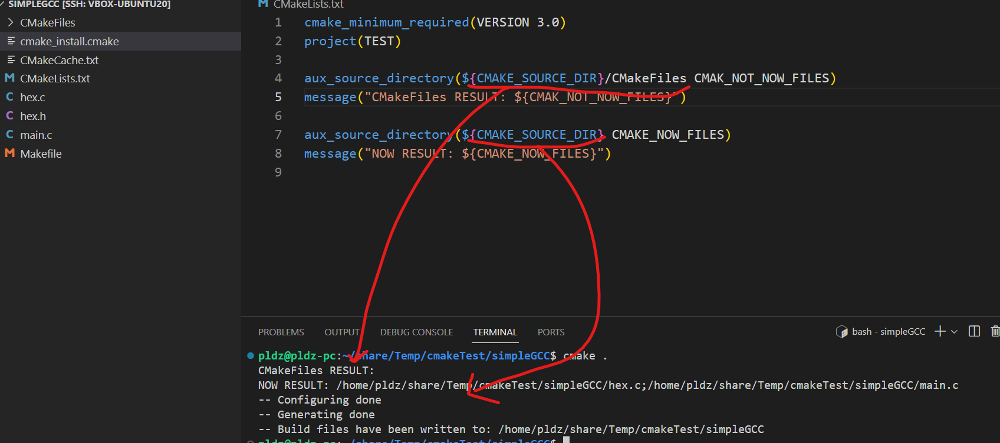

## 2.5 CMake 的逻辑语法指令

> 简单介绍 CMake 工具的逻辑语句的命令的主要作用，这部分很类似于 C/C++代码中的`for`, `if/else`等等..., 用于控制流程、条件判断和循环迭代.

### 2.5.1 判断语句 if/else

1. `if/else` 用法:

```cmake
if(condition) # 如果条件为真，执行这里的代码
else() # 如果条件为假，执行这里的代码
endif()
```

2. 示例, 判断当前操作系统的类型：

```cmake
cmake_minimum_required(VERSION 3.0)
project(TEST)

if(WIN32)
message("Running on Windows")
elseif(APPLE)
message("Running on macOS")
elseif(UNIX)
message("Running on Linux")
else()
message("Sorry i dont know.")
endif()
```

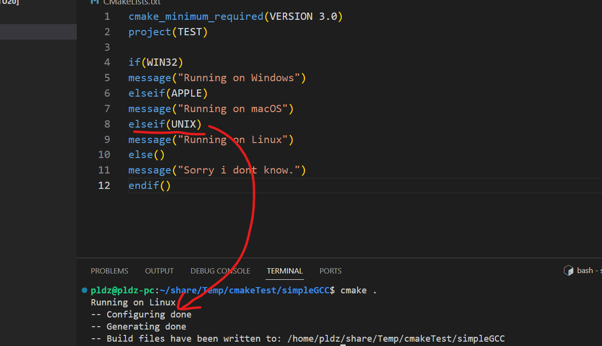

### 2.5.2 循环语句 foreach

1. `foreach` 命令用法：

```cmake
foreach(var IN items) # 对每个元素执行这里的代码
endforeach()
```

2. 示例：

```cmake
set(LIST_ITEMS "apple" "banana" "orange")
foreach(item IN LISTS LIST_ITEMS)
message("Fruit: ${item}")
endforeach()
```

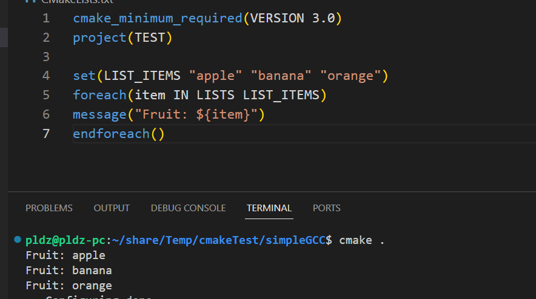

### 2.5.3 选项指令 option

1. `option`命令用法, 与`if/else`语句的区别在于, `option`更适合用作配置操作的选择:

```cmake
option(option_name "option_description" [initial_value])
```

2. 示例：

```cmake
cmake_minimum_required(VERSION 3.0)
project(TEST)

option(USE_FEATURE "Enable feature" ON)
if(USE_FEATURE)
message("Feature enabled")
else()
message("Feature disabled")
endif()
```

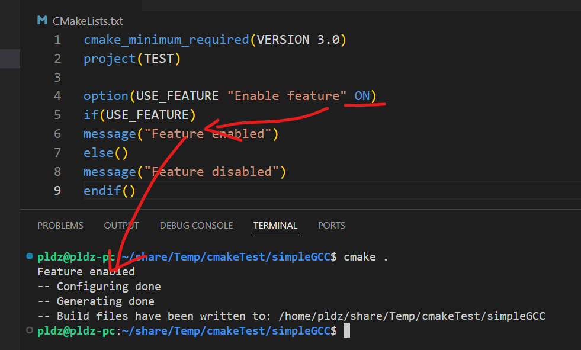

### 2.5.4 其他指令的主要功能

- `unset`：用于取消设置变量.
- `set_directory_properties`：用于设置目录属性.
- `set_property`：用于设置属性的值.
- `site_name`：用于设置或查询当前 CMake 脚本的源文件名.

- `mark_as_advanced`：将变量标记为高级选项，使其在 GUI 中不可见.
- `math`：提供了一些数学运算函数.

- `cmake_host_system_information`：用于获取有关主机系统的信息，例如操作系统类型、处理器类型等.
- `cmake_language`：用于指定 CMake 语言版本.
- `cmake_minimum_required`：用于指定所需的最低 CMake 版本.
- `cmake_parse_arguments`：用于解析命令行参数，并将其存储在变量中.
- `cmake_path`：提供了一些与路径相关的函数，例如获取文件名、扩展名等.
- `cmake_policy`：用于设置或查询 CMake 的策略.

- `block`：用于定义一个代码块，可以在该块中定义变量、函数和其他 CMake 指令.
- `endblock`：结束一个代码块.

- `configure_file`：用于通过替换文件中的变量来生成新文件.
- `continue`：用于跳过当前循环中的剩余代码，并继续下一次循环迭代.
- `break`：用于终止当前正在执行的循环.
- `endforeach`：结束一个 foreach 循环.
- `while`：用于创建一个循环，只要条件为真，就会一直执行循环体中的代码.
- `endwhile`：结束一个 while 循环.

- `function`：用于定义一个函数.
- `endfunction`：结束一个函数定义.
- `return`：从函数中返回.

- `macro`：用于定义一个宏.
- `endmacro`：结束一个宏定义.

- `include`：用于包含其他 CMake 脚本.
- `include_guard`：用于防止多次包含同一个文件.
- `execute_process`：用于在构建过程中执行外部进程.

- `find_file`、`find_library`、`find_package`、`find_path`和`find_program`：用于在系统中查找文件、库、包、路径和可执行程序.
- `get_cmake_property`、`get_directory_property`、`get_filename_component`和`get_property`：用于获取 CMake 属性和变量的值.

- `string`：提供了一些与字符串相关的函数，例如截取、替换、转换等.
- `separate_arguments`：用于将字符串参数分割为独立的参数.
- `variable_watch`：用于在变量更改时触发自定义操作.
