# 3. CMake 配置项目的基本指令

## 3.1 CMake 配置项目的基本指令

> 对于生成项目的可执行文件的操作, 实际上不管是采用 GCC 还是 CMake 工具，都是类似的，也就是从项目的`mian()`函数出发，找到项目依赖的全部的头文件/库文件/源文件等, 打包生成可执行程序;

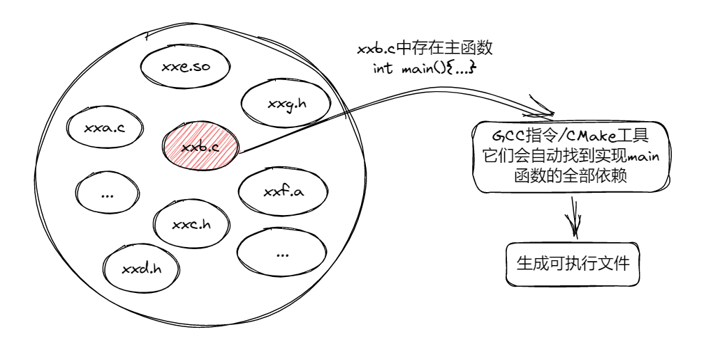

### 3.1.1 GCC 配置项目的快速体验

> [源文件在不同目录下用 gcc 编译多个.h .c 文件](https://www.cnblogs.com/lihello/p/14435941.html)

0. 假设我们存在一个 C 项目，项目把输入的 16 进制的字符串给转成 10 进制数字，或者八进制和二进制字符串，项目的文件结构如下所示：

```shell
.
├── include         // include文件夹存放头文件
│   ├── hexCov.h    // 主函数的头文件
│   ├── hex2bin.h   // 十六进制转二进制的头文件
│   ├── hex2dec.h   // 十六进制转十进制的头文件
│   └── hex2otc.h   // 十六进制转八进制的头文件
└── src             // 存放项目源码/.c文件的目录
    ├── hexCov.c    // 项目的函数汇总，主要用于后续编译.so动态库/.a静态库
    └── main.c      // 项目的主函数文件
```

1. `hexCov.h`文件，声明主要的函数，但是不实现它:

```c
#include <stdio.h>

int hexCov();
```

2. `hex2bin.h`文件, 声明并实现十六进制转二进制的方法:

```c
#include <stdio.h>
#include <stdlib.h>

void hexToBinary(const char *hexStr, char binaryStr[])
{
    long decimal = strtol(hexStr, NULL, 16);
    int i = 0;
    while (decimal > 0)
    {
        binaryStr[i] = (decimal % 2) + '0';
        decimal /= 2;
        i++;
    }
    binaryStr[i] = '\0';

    // 翻转字符串
    int start = 0;
    int end = i - 1;
    while (start < end)
    {
        char temp = binaryStr[start];
        binaryStr[start] = binaryStr[end];
        binaryStr[end] = temp;
        start++;
        end--;
    }
}
```

3. `hex2dec.h`文件, 声明并实现十六进制转十进制的方法:

```c
#include <stdlib.h>

long hexToDec(const char *hexStr)
{
    return strtol(hexStr, NULL, 16);
}
```

4. `hex2otc.h`文件, 声明并实现十六进制转八进制的方法:

```c
#include <stdio.h>

void hexToOct(char *hexStr, char octalStr[])
{
    long decimal = strtol(hexStr, NULL, 16);
    sprintf(octalStr, "%lo", decimal);
}
```

5. `hexCov.c`文件, 实现函数文件, 这个文件很有意思的在于,`main.c` 文件如果想实现功能，那么它必须需要包括这个这个文件:

```c
#include "hex2bin.h"
#include "hex2dec.h"
#include "hex2otc.h"

void decToBinary(const char *hexStr, char binaryStr[]);
long hexToDec(const char *hexStr);
void decToOct(long decimal, char octalStr[]);

int hexCov()
{
    char hexStr[100];
    printf("Enter a hexadecimal number: ");
    scanf("%s", hexStr);

    // 将十六进制字符串转换为十进制整数
    long decimal = hexToDec(hexStr);
    printf("Decimal: %ld\n", decimal);

    // 将十六进制字符串转换为八进制字符串
    char octalStr[100];
    hexToOct(hexStr, octalStr);
    printf("Octal: %s\n", octalStr);

    // 将十六进字符串转换为二进制字符串
    char binaryStr[100];
    hexToBinary(hexStr, binaryStr);
    printf("Binary: %s \n", binaryStr);
    return 0;
}
```

6. `main.c`文件, 项目主函数的入口:

```c
#include "hexCov.h"

int main()
{
    hexCov();
    return 0;
}
```

7. 采用 GCC 编译的指令: `gcc ./src/main.c -I ./include/ -o test`

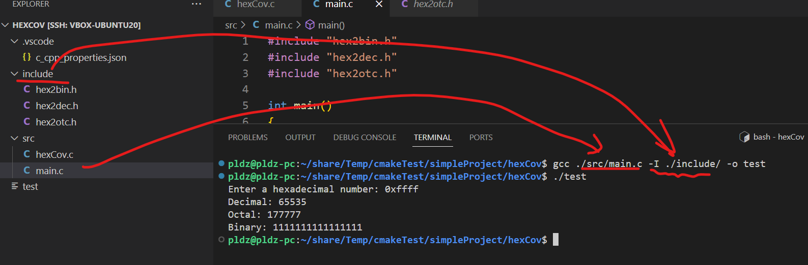

### 3.1.2 解决 VSCode CMake 文件目录的配置

### 3.1.3 包含头文件 include_directories

1. `include_directories`命令将头文件目录添加到构建过程中。`include_directories`可以接受一个或多个参数，**每个参数都是一个目录路径**，指定要包含的头文件所在的目录.CMake 构建项目时，会在指定的目录中查找头文件， 使用`include_directories`命令，可以确保在编译源文件时，编译器能够找到所需的头文件.

2. `include_directories`用法：`include_directories(dir1 dir2 ...)`, 其中，`dir1`、`dir2`等是要包含的头文件目录路径。

3. 这个命令通常与`target_link_libraries`命令一起使用，以确保在链接过程中能够找到所需的头文件.

那么这个时候的 `CMakeLists.txt` 脚本可以写成如下格式：

```cmake
cmake_minimum_required(VERSION 3.0)
project(HEXCOV)

# 当前工作空间的目录和CMakeLists.txt文件位置一致
set(WORKSPACE_PATH ${CMAKE_SOURCE_DIR})

# 添加头文件的路径
include_directories(${WORKSPACE_PATH}/include)

# 设置可执行文件的输出位置
set(EXECUTABLE_OUTPUT_PATH ${WORKSPACE_PATH})

# 生成执行文件
add_executable(test ${WORKSPACE_PATH}/src/main.c ${WORKSPACE_PATH}/src/hexCov.c)
```

4. 编译运行：跳转到项目的`build`文件夹，输入指令`cmake ..`, CMake 语法没有问题之后，也在`build`文件夹下输入`make`生成可执行文件.

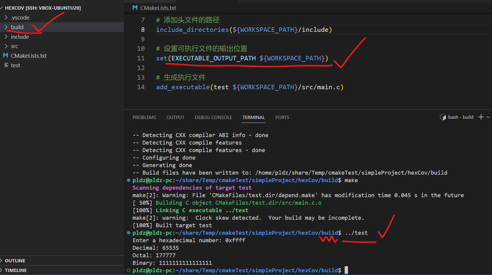

### 3.1.4 包含源文件 aux_source_directory

1. `aux_source_directory`: 用于将指定目录中的源文件自动添加到一个变量中。它的使用格式如下:`aux_source_directory(<dir> <variable>)`; 其中：`<dir>`: 是要扫描的目录路径; `<variable>`: 是存储扫描到的源文件的变量名称。

2. `aux_source_directory` 命令会自动扫描指定目录下的源文件，并将它们的路径添加到指定的变量中.

3. `aux_source_directory` 只会将目录下的源文件添加到变量中，而不会包含子目录中的源文件.

4. 那么 CMakeLists.txt 文件可以改写为这样:

```cmake
cmake_minimum_required(VERSION 3.0)
project(HEXCOV)

# 当前工作空间的目录和CMakeLists.txt文件位置一致
set(WORKSPACE_PATH ${CMAKE_SOURCE_DIR})

# 添加头文件的路径
include_directories(${WORKSPACE_PATH}/include)

# 添加源文件
# file(GLOB SRCS ${WORKSPACE_PATH}/src/*.c)
# 上下两个指令都是可以的
aux_source_directory(${WORKSPACE_PATH}/src SRCS)

# 设置可执行文件的输出位置
set(EXECUTABLE_OUTPUT_PATH ${WORKSPACE_PATH})

# 生成执行文件
add_executable(test ${SRCS})
```

### 3.1.5 包括库文件 target_link_libraries

1. 修改`main.c`代码，添加`math.h`和`pthread.h`此时按照上面的 CMakeLists.txt 脚本运行，则会出错, 因为缺少数学库`libm.so`和线程库`libpthread.so`

2. `target_link_libraries` 用于将目标与一个或多个库进行链接;它的使用格式如下: `target_link_libraries(<target> <PRIVATE|PUBLIC|INTERFACE> <library> ...)`

- `<target>` 是要链接库的目标（可执行文件、静态库或动态库）的名称;
- `<PRIVATE|PUBLIC|INTERFACE>` 是链接库的范围，可以是 PRIVATE、PUBLIC 或 INTERFACE;
- `PRIVATE` 表示该库仅在当前目标中使用;
- `PUBLIC` 表示该库在当前目标以及依赖于当前目标的其他目标中使用;
- `INTERFACE` 表示该库仅在依赖于当前目标的其他目标中使用;
- `<library> ...` 是要链接的库的名称;

2. `target_link_libraries` 将目标与编译时需要的库进行链接，**包括静态库和动态库**.

3. 链接库时，可以指定库的名称，也可以使用变量来代替.

4. 动态库的名称均是形如`libxxx.so`由`lib`开头, `.so`结尾, 其中的`xxx`便是动态库的名称.

5. 静态库的名称均是形如`libxxx.a`由`lib`开头, `.a`结尾, 其中的`xxx`便是静态库的名称.

6. 如果链接的是系统提供的库，只需指定库的名称即可，如 `target_link_libraries(test pthread)`.

7. 如果链接的是自定义的库（静态库或动态库），通常需要提供库的完整路径，如 `target_link_libraries(test ${CMAKE_SOURCE_DIR}/libs/libmy)`.

8. 静态库是在编译时被链接到最终可执行文件或其他目标中，而动态库是在运行时被动态加载到内存中.

9. 那么此时的 CMakeLists.txt 文件可以书写为以下：

```cmake
cmake_minimum_required(VERSION 3.0)
project(HEXCOV)

# 当前工作空间的目录和CMakeLists.txt文件位置一致
set(WORKSPACE_PATH ${CMAKE_SOURCE_DIR})

# 添加头文件的路径
include_directories(${WORKSPACE_PATH}/include)

# 添加源文件
# file(GLOB SRCS ${WORKSPACE_PATH}/src/*.c)
# 上下两个指令都是可以的
aux_source_directory(${WORKSPACE_PATH}/src SRCS)

# 设置可执行文件的输出位置
set(EXECUTABLE_OUTPUT_PATH ${WORKSPACE_PATH})

# 生成执行文件
add_executable(test ${SRCS})

# 连接动态库
target_link_libraries(test m pthread)
```

### 3.1.6 生成静态库和动态库 add_library

1. `add_library` 用于创建一个静态库或动态库, 它的语法：

```shell
add_library(<name> [STATIC | SHARED | MODULE]
            [EXCLUDE_FROM_ALL]
            [<source>...])
```

- `<name> 是库的名称，用于在后续的链接过程中引用该库;
- `[STATIC | SHARED | MODULE]` 是可选参数，指定要创建的库的类型;
- `STATIC` 表示创建静态库，它会将源文件编译成目标文件，并将这些目标文件打包成一个静态库文件（如.a、.lib）;
- `SHARED` 表示创建动态库，它会将源文件编译成目标文件，并将这些目标文件打包成一个动态库文件（如.so、.dll）;
- `MODULE` 表示创建模块库，它类似于动态库，但在某些平台上有不同的加载方式;
- `[EXCLUDE_FROM_ALL]` 是可选参数，表示该库不会被默认构建;如果希望将该库作为可选项构建，可以使用该参数;
- `source1 [source2 ...]` 是要编译到库中的源文件列表;

2. add_library 命令用于创建静态库或动态库，库的名称应该是唯一的，并且在后续的链接过程中要被引用.

3. 指定库的输出位置：`set(LIBRARY_OUTPUT_PATH <path>)`, 其中的`LIBRARY_OUTPUT_PATH`作为宏定义的参数, `<path>`是指定的位置.

4. 实际上，如果`source1 [source2 ...]`能够生成目标文件，那么它也能生成库文件.

5. 如果将最后的程序打包为动态库，则可以这样写 `CMakeLists.txt`:

```cmake
cmake_minimum_required(VERSION 3.0)
project(HEXCOV)

# 当前工作空间的目录和CMakeLists.txt文件位置一致
set(WORKSPACE_PATH ${CMAKE_SOURCE_DIR})

# 添加头文件的路径
include_directories(${WORKSPACE_PATH}/include)

# 添加源文件
# file(GLOB SRCS ${WORKSPACE_PATH}/src/*.c)
# 上下两个指令都是可以的
aux_source_directory(${WORKSPACE_PATH}/src SRCS)

# 设置可执行文件的输出位置
set(EXECUTABLE_OUTPUT_PATH ${WORKSPACE_PATH})

# 生成执行文件
add_executable(test ${SRCS})

# 连接动态库
target_link_libraries(test m pthread)

# 指定库的路径与CMakeLists.txt同一个层级
set(LIBRARY_OUTPUT_PATH ${WORKSPACE_PATH})
add_library(hexCov0 STATIC ${SRCS})
add_library(hexCov1 SHARED ${SRCS})
```

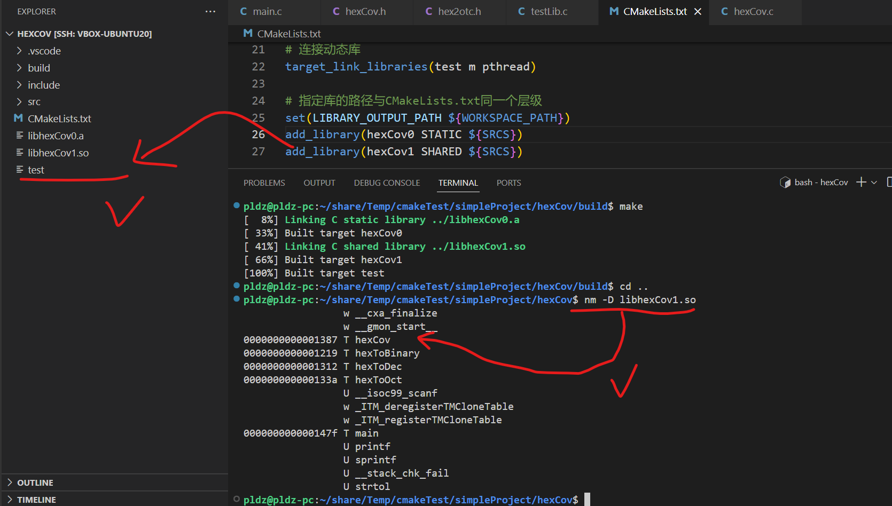

## 3.2 配置复杂项目的思路

### 3.2.1 复杂项目的 CMake 例子

> 如果项目比较大的情况下，单个 `CMakeLists.txt` 对项目的管理就容易混乱，目前主流的方式，是采用树状模式，将复杂的项目由一个根` CMakeLists.txt` 进行管理，各个子项目分别用被它的子 `CMakeLists.txt` 管理, 其中**包括你的 main.c 文件的那个层级的文件夹也算作是子项目**.

> 以本文的工程为例子，讨论根和子 `CMakeLists.txt` 的注意事项.

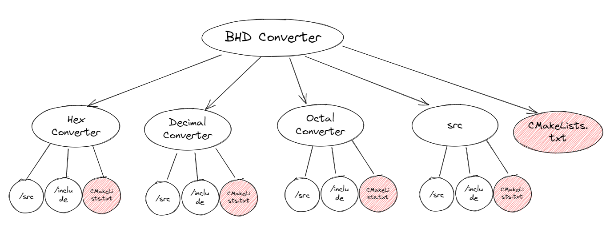

```shell
.
├── build
├── CMakeLists.txt
├── decCov
│   ├── build
│   ├── CMakeLists.txt
│   ├── include
│   │   ├── dec2bin.h
│   │   ├── dec2hex.h
│   │   ├── dec2oct.h
│   │   └── decCov.h
│   └── src
│       ├── decCov.c
│       └── main.c
├── hexCov
│   ├── build
│   ├── CMakeLists.txt
│   ├── include
│   │   ├── hex2bin.h
│   │   ├── hex2dec.h
│   │   ├── hex2otc.h
│   │   └── hexCov.h
│   └── src
│       ├── hexCov.c
│       ├── main.c
│       └── testLib.c
├── libs
│   ├── libdeccov.a
│   ├── libhexcov.a
│   └── liboctcov.a
├── octCov
│   ├── build
│   ├── CMakeLists.txt
│   ├── include
│   │   ├── oct2bin.h
│   │   ├── oct2dec.h
│   │   ├── oct2hex.h
│   │   └── octCov.h
│   └── src
│       ├── main.c
│       └── octCov.c
└── src
    ├── CMakeLists.txt
    └── main.c
```

### 3.2.2 子目录设置 add_subdirectory

1. `add_subdirectory` 用于向当前项目添加一个子目录, 它的使用格式如下：`add_subdirectory(source_dir [binary_dir] [EXCLUDE_FROM_ALL])`

- `source_dir` 是要添加的子目录的路径;

- `binary_dir` 是可选参数，用于指定构建子目录的二进制输出路径。如果不指定，则默认为`${CMAKE_CURRENT_BINARY_DIR}/source_dir`,一般而言，都是不指定的;

- `EXCLUDE_FROM_ALL` 是可选参数，表示将子目录排除在默认构建目标之外;

- `add_subdirectory` 指令可以将其他目录中的 `CMakeLists.txt` 文件引入到当前项目中。这样可以将整个项目划分为多个子目录，每个子目录对应一个模块或子项目;在使用 `add_subdirectory` 指令时，需要确保指定的 `source_dir` 目录中包含有效的 `CMakeLists.txt` 文件;

- 子目录中的 `CMakeLists.txt` 文件会被自动加载和处理，将其包含的内容添加到当前项目中;子目录中的 `CMakeLists.txt` 文件可以使用和当前项目相同的变量、函数和其他 `CMake` 命令;

2. 关注的重点：

- 1. **CMake 的语句是按照顺序执行的**，`add_subdirectory`指令就是调用子项目的`CMakeLists.txt`脚本, 父`CMakeLists.txt`的变量可以被子`CMakeLists.txt`读取到，反之不行.

- 2. 子项目的`CMakeLists.txt`中的`cmake`语法宏定义一些参数已经是其父节点`CMakeLists.txt`的内容了，比方说`CMAKE_SOURCE_DIR`就是始终指向父节点`CMakeLists.txt`的位置.

- 3. 子项目的`CMakeLists.txt`中的一些针对项目本身的设置参数，还是随着`CMakeLists.txt`脚本而变化,例如父节点的`PROJECT_SOURCE_DIR`指向的是父节点的`CMakeLists.txt`路径，例如为`./A`，例如 A 下面的 AA 文件夹的`CMakeLists.txt`得到的`PROJECT_SOURCE_DIR`就是`./A/AA`

- 4. **针对一些会被主函数入口调用到的头文件，它的`include_directories`设置可以放在父节点上，这样子节点都能拿到这些库文件**.

- 5. **父节点上，还可以设置子项目生成的可执行文件位置或者是动态库/静态库文件的位置，作为一个全局设置**.

- 6. 在子目录中，可以定义自己的库、可执行文件或其他编译目标，并根据需要进行配置;子目录的构建结果可以在父目录中进行链接和使用, 也可以作为库供其他子目录或父目录使用，也可以作为可执行文件独立运行，也就是说习惯将入口函数的项目放在最后这样可以让它去调用一些子项目的库文件.这段话可以这么理解，首先子项目作为单独的内容编译生成了库文件，然后它的源码不暴露，头文件保留声明，保护源码不被修改，例如这里的`libm`库内的`pow`函数，只有声明，源码在`libm.so`内

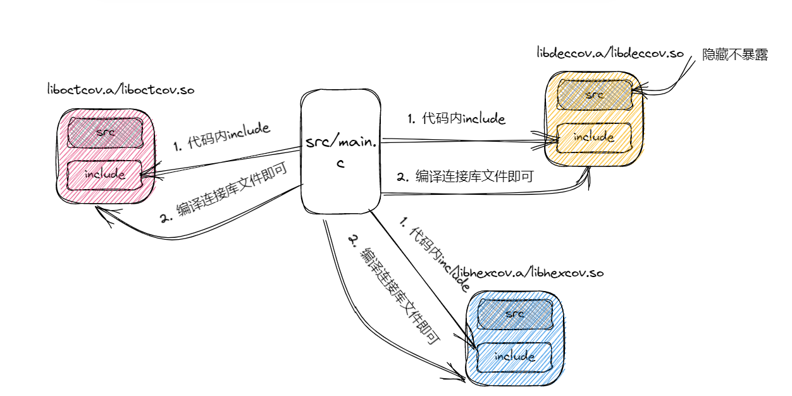

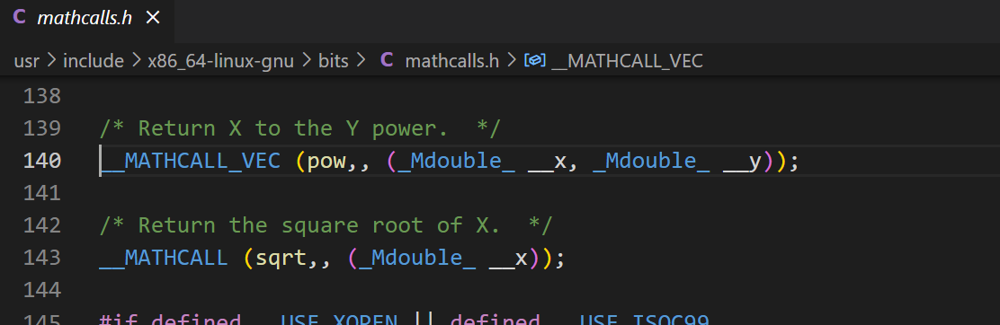

1. 那么本个例子的父节点的`CMakeLists.txt`可以这么写

```cmake
cmake_minimum_required(VERSION 3.0)
project(BCDCOV)

# 设置工程的路径，也就是和CMakeLists.txt同一个层级的目录，同时声明为可以传递给子cmake的全局变量.
set(PROPATH ${CMAKE_SOURCE_DIR})
message(">>> I am parents directory, CMAKE_SOURCE_DIR is: " ${PROPATH})

# 设置库文件输出位置
set(CMAKE_ARCHIVE_OUTPUT_DIRECTORY ${PROJECT_SOURCE_DIR}/libs)
message(">>> I am parents directory, PROJECT_SOURCE_DIR is: " ${PROJECT_SOURCE_DIR})

# 设置可执行文件的输出位置
set(EXECUTABLE_OUTPUT_PATH ${PROJECT_BINARY_DIR})

# 设置头文件的位置，为了最后的main.c能够找到头文件.
include_directories(${PROJECT_SOURCE_DIR}/decCov/include)
include_directories(${PROJECT_SOURCE_DIR}/hexCov/include)
include_directories(${PROJECT_SOURCE_DIR}/octCov/include)

# 添加子目录
add_subdirectory(${PROPATH}/decCov)
add_subdirectory(${PROPATH}/hexCov)
add_subdirectory(${PROPATH}/octCov)
add_subdirectory(${PROPATH}/src)
```

4. 那么`decCov`, `hexCov`, `octCov`三个子文件夹分别构建出`libdeccov.a`, `libhexcov.a`, `liboctcov.a`到最外层的 lib 目录, 他们的`CMakeLists.txt`可以这么写:

5. `decCov`子项目`CMakeLists.txt`可以这样写：

```cmake
cmake_minimum_required(VERSION 3.0)
project(DECCOV)

# 输出一段话，观察add_subdirectory的顺序.
message(">>> Into decCov CMakeLists.txt")

# 查看父CMakeLists.txt的变量传递到子文件中的例子
message("<<< Parent path: " ${PROPATH})

# 此时的cmake语法中的宏变量是针对于父CMakeLists.txt的变量了.
message("<<< In decCov PROJECT_SOURCE_DIR is: " ${CMAKE_SOURCE_DIR})

# 此时针对项目的变量依旧是指向当前CMakeLists.txt的值
message("<<< In decCov PROJECT_SOURCE_DIR is: " ${PROJECT_SOURCE_DIR})

# 设置当前的工作空间
set(CUR_DIR ${CMAKE_CURRENT_SOURCE_DIR})

# 生成库文件
# 源文件已经在父CMakeLists.txt添加完成不需要再添加源文件.
# 添加源文件，注意，此时不添加main.c进去，否则会出现多个mian函数入口！
add_library(deccov STATIC ${CUR_DIR}/src/decCov.c)
```

6. `hecCov`子项目`CMakeLists.txt`可以这样写：

```cmake
cmake_minimum_required(VERSION 3.0)
project(HEXCOV)

# 输出一段话，可以显示CMake的进度.
message(">>> Into hexCov CMakeLists.txt")

# 设置当前的工作空间
set(CUR_DIR ${CMAKE_CURRENT_SOURCE_DIR})

# 生成库文件
# 源文件已经在父CMakeLists.txt添加完成不需要再添加源文件.
# 添加源文件，注意，此时不添加main.c进去，否则会出现多个mian函数入口！
add_library(hexcov STATIC ${CUR_DIR}/src/hexCov.c)

```

7. `octCov`子项目`CMakeLists.txt`可以这样写：

```cmake
cmake_minimum_required(VERSION 3.0)
project(OCTCOV)

# 输出一段话，可以显示CMake的进度.
message(">>> Into octCov CMakeLists.txt")

# 设置当前的工作空间
set(CUR_DIR ${CMAKE_CURRENT_SOURCE_DIR})

# 生成库文件
# 源文件已经在父CMakeLists.txt添加完成不需要再添加源文件.
# 添加源文件，注意，此时不添加main.c进去，否则会出现多个mian函数入口！
add_library(octcov STATIC ${CUR_DIR}/src/octCov.c)

```

8. `src`目录下有一个`main.c` 它就需要引用了`decCov`, `hexCov`, `octCov`中的头文件和`libdeccov.a`, `libhexcov.a`, `liboctcov.a`，构建出一个`test.elf`文件

```cmake
cmake_minimum_required(VERSION 3.0)
project(BCDCORE)

# 可执行文件
add_executable(test.elf main.c)
# 可执行文件依赖的库文件包括一个数学库math也就是m(-lm)
target_link_libraries(test.elf deccov hexcov octcov m)

```

9. 观察`cmake`指令的输出：

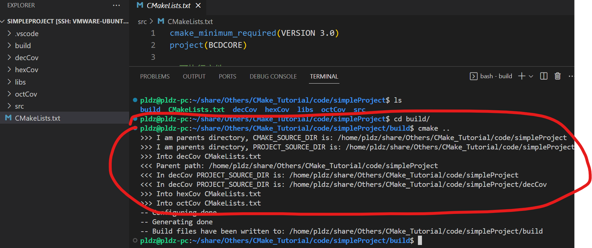

10. 查看构建的文件：

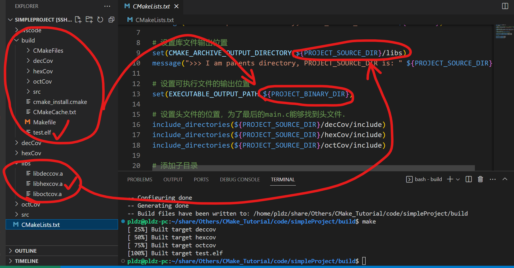

## 3.3 CMake 工具的交叉编译

什么是交叉编译：**在一个平台上生成另一个平台上的可执行代码**。例如，在 `x86_64 Linux` 平台上，可以使用交叉编译工具`aarch64-linux-gnu-`链生成针对 `ARM` 体系结构的 `Linux` 可执行文件.

交叉编译包括什么：编译器、链接器和其他必要的工具和依赖.

这里以主机（也就是我现在的PC电脑）为`x86_64 Linux`交叉编译一个`aarch64`架构的可执行文件为例, 首先需要安装交叉编译工具：[交叉编译工具链--aarch64安装流程](https://zhuanlan.zhihu.com/p/559223055)，例子的话可以参考：[ARM平台搭建Python环境](https://blog.csdn.net/qq_42727752/article/details/128314830)


1. 设置交叉编译工具链：在`CMake`中，使用`set(CMAKE_C_COMPILER <path>)`和`set(CMAKE_CXX_COMPILER <path>)`命令设置用于交叉编译`aarch64`架构的交叉编译工具


```cmake
# 设置C代码的交叉编译工具绝对路径位置
set(CMAKE_C_COMPILER   <path>)
# 设置CPP代码的交叉编译工具绝对路径位置
set(CMAKE_CXX_COMPILER <path>)
```

> 可以通过`whereis`命令找出工具为位置：
> ```shell
> pldz@pldz-pc:~/share/Others/CMake_Tutorial/code/simpleProject$ whereis aarch64-linux-gnu-gcc
> aarch64-linux-gnu-gcc: /home/pldz/aarch64/bin/aarch64-linux-gnu-gcc
> ```

2. 设置目标架构和系统：使用`set()`命令设置`CMAKE_SYSTEM_PROCESSOR`变量来指定目标架构，`CMAKE_SYSTEM_NAME`变量来指定目标系统，例如这里的`aarch64`架构的`Linux`系统：
```cmake
# 设置目标系统的架构
set(CMAKE_SYSTEM_PROCESSOR aarch64)

# 设置目标系统的类型
set(CMAKE_SYSTEM_NAME Linux)
```

3. 设置交叉编译选项：如指定目标系统的根目录、库目录等，这里列举部分：

```cmake
# 设置交叉编译工具的root目录
set(CMAKE_FIND_ROOT_PATH <path>)

# 设置交叉编译工具的lib目录
set(CMAKE_LIBRARY_PATH <path>)
```

4. 设置编译器和链接器标志：某些情况下需要设置一些特定的编译器和链接器标志才能正确的构建，则需要设置`CMAKE_C_FLAGS`和`CMAKE_EXE_LINKER_FLAGS`等变量，例如：


```cmake
# 设置连接标志armv8表示arm64
set(CMAKE_C_FLAGS "${CMAKE_C_FLAGS} -march=armv8-a")
set(CMAKE_EXE_LINKER_FLAGS "${CMAKE_EXE_LINKER_FLAGS} -L/path/to/aarch64-linux-libs")
```

5. 对于包含子目录的复杂`CMake`的项目，交叉编译的选项应该放在项目`project`前进行设置，否则可能陷入检查变量被修改而陷入cmake循环:

```cmake
# 假设进行交叉编译
# 设置目标机器类型.
set(CMAKE_SYSTEM_NAME Linux)
# 设置目标系统架构.
set(CMAKE_SYSTEM_PROCESSOR aarch64)
# 设置交叉编译的工具链位置.
set(CROSS_CHAIN_PATH  /home/pldz/aarch64)
# 设置交叉编译的工具.
set(CMAKE_C_COMPILER ${CROSS_CHAIN_PATH}/bin/aarch64-linux-gnu-gcc)
set(CMAKE_CXX_COMPILER ${CROSS_CHAIN_PATH}/bin/aarch64-linux-gnu-g++)

project(BCDCOV)
```

上诉的项目则可以修改它的主`CMakeLists.txt`文件为：

```cmake
cmake_minimum_required(VERSION 3.0)

# 假设进行交叉编译,在project设置之前设置交叉编译的工具设置！
# 设置目标机器类型.
set(CMAKE_SYSTEM_NAME Linux)
# 设置目标系统架构.
set(CMAKE_SYSTEM_PROCESSOR aarch64)
# 设置交叉编译的工具链位置.
set(AARCH64_CHAIN_PATH /home/pldz/aarch64/bin)
# 设置交叉编译的工具.
set(CMAKE_C_COMPILER ${AARCH64_CHAIN_PATH}/aarch64-linux-gnu-gcc)
set(CMAKE_CXX_COMPILER ${AARCH64_CHAIN_PATH}/aarch64-linux-gnu-g++)

project(BCDCOV)

# 设置工程的路径，也就是和CMakeLists.txt同一个层级的目录，同时声明为可以传递给子cmake的全局变量.
set(PROPATH ${CMAKE_SOURCE_DIR})
message(">>> I am parents directory, CMAKE_SOURCE_DIR is: " ${PROPATH})

# 设置库文件输出位置
set(CMAKE_ARCHIVE_OUTPUT_DIRECTORY ${PROJECT_SOURCE_DIR}/libs)
message(">>> I am parents directory, PROJECT_SOURCE_DIR is: " ${PROJECT_SOURCE_DIR})

# 设置可执行文件的输出位置
set(EXECUTABLE_OUTPUT_PATH ${PROJECT_BINARY_DIR})

# 设置头文件的位置，为了最后的main.c能够找到头文件.
include_directories(${PROJECT_SOURCE_DIR}/decCov/include)  
include_directories(${PROJECT_SOURCE_DIR}/hexCov/include)  
include_directories(${PROJECT_SOURCE_DIR}/octCov/include)  

# 添加子目录
add_subdirectory(${PROPATH}/decCov)
add_subdirectory(${PROPATH}/hexCov)
add_subdirectory(${PROPATH}/octCov)
add_subdirectory(${PROPATH}/src)

```

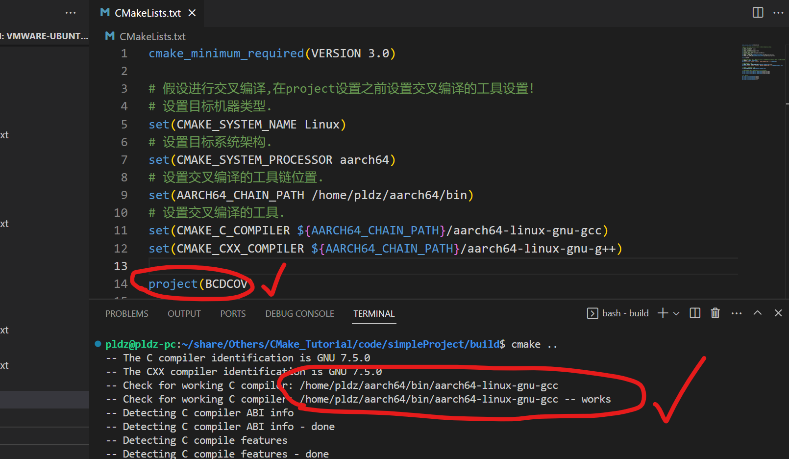


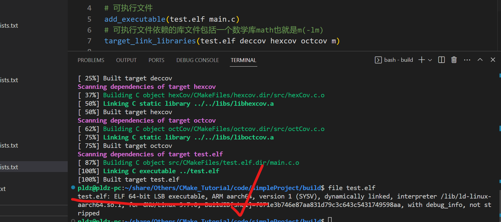