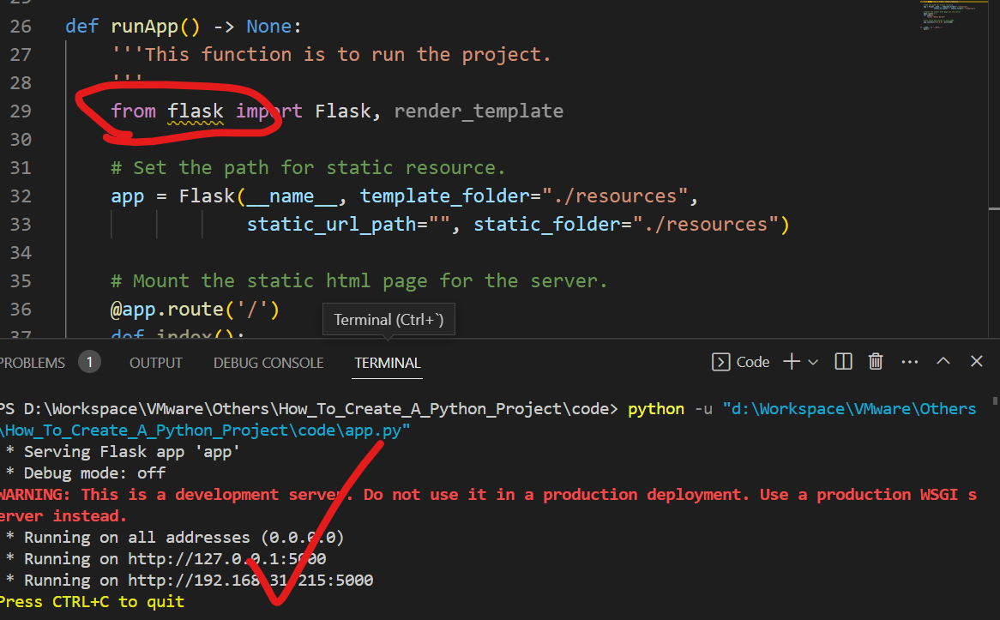
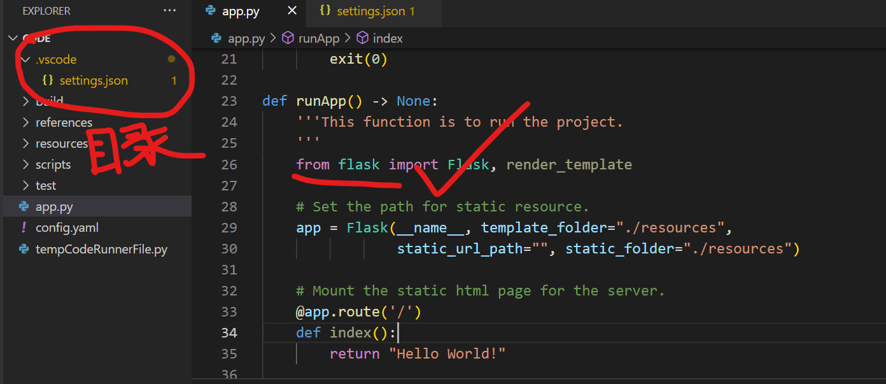
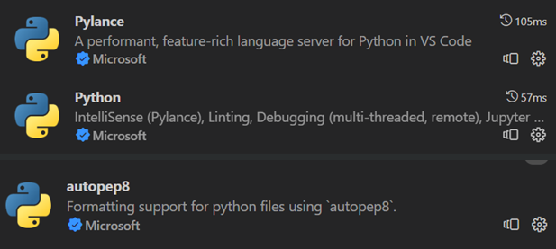

# 使用 VSCode 创建一个 Python 项目

**概括**：本文主要是我自己在进行 Python 项目开发过程中，该怎么样初始化创建一个 Python 的项目，该怎么对第三方包的安装管理方便移植到其他的系统上， 该怎么样最开始配置 Python 项目的目录结构的思考，下面依次会介绍以下内容，欢迎大家积极交流：

- 1. 一个合适的 Python 的目录结构，怎么安装项目所需要的第三库，有什么注意内容.
- 2. 介绍怎么用 VScode 联合 Pylance 和 autopep-8 配置我们的 Python 项目.
- 3. 使用 Git 管理 Python 项目时候，最好怎么固定项目的文件结构.
- 4. Python 项目的 Log 内容和配置模板.

> 本文全部内容的代码仓库：[]()

## 1. Python 项目目录以及运行第三方库的方法

### 1.1 Python 项目目录和下载第三方库
#### 1.1.1 Python 项目的目录

> 项目其实没有固定格式的目录，完全按照各位项目实际需求进行配置，这里只是我个人的一点使用习惯.

我的个人习惯，在一个 Python 项目中包括以下文件夹和内容：

```
pldz@pldz-pc:/mnt/hgfs/VMware/Others/How_To_Create_A_Python_Project$ tree -L 3
.
├── app.py
├── build
├── config.yaml
├── references
├── resources
├── scripts
│   └── lib
│       ├── config.py
│       └── log.py
└── test
```

- `app.py`文件：用于编写主要的 Python 项目启动逻辑，作为项目的入口函数，同样也是项目的路径位置(利用 Python 的`__file__`属性配置项目路径).

- `build`目录：用于存放 Python 项目用到的第三方库，也就是 pip 下载的包的位置，我们可以采用`pip install <包名> --target=<当前的build文件夹的路径>`，将第三方内容下载到我们的项目下，方便项目移植，后面会专门介绍.

- `config.yaml`文件:作为外部用户可以对项目内容修改的配置属性文件.

- `references`目录: 存放一下项目的参考资料，或者是历史记录等等.

- `resources`目录：存放项目的静态资源，如项目可能读写到的文件，web 项目的 dist 文件等等.

- `scripts`目录:存放 Python 的核心代码，里面可以再包括很多层级的目录完成需求，例如`lib`文件夹，存放一些不依赖任何库的脚本，用于配置项目，`module`文件夹用于存放一些自己写的模块等等.

#### 1.1.2 Python 项目安装第三方安装包的方法

> 一般情况下，我们会使用`pip`下载了依赖项，但是此时移植到新的设备环境下，又要重新`pip3`下载，但是有些场景是没有办法连接网络的，这个时候需要进行在项目中直接下载到这个包，接下来的内容，我们以`flask`包举例：

1. 通过`pip3`中的`--target`下载指定的包到项目目录下，例如这里下载`flask`并开辟一个web 服务器,可以看到的是下载完成包之后，并不影响我们的Python环境:`pip3 install flask --target=<build目录的绝对路径>`

```shell
D:\Workspace\VMware\Others\How_To_Create_A_Python_Project\code>pip3 list
Package               Version
--------------------- ---------
certifi               2022.9.24
charset-normalizer    2.1.1
distlib               0.3.6
docopt                0.6.2
filelock              3.8.0
idna                  3.4
numpy                 1.23.4
opencv-contrib-python 4.6.0.66
opencv-python         4.6.0.66
pip                   21.1.1
pipreqs               0.4.11
platformdirs          2.5.4
requests              2.28.1
setuptools            56.0.0
urllib3               1.26.12
virtualenv            20.16.7
virtualenvwrapper-win 1.2.7
yarg                  0.1.9
WARNING: You are using pip version 21.1.1; however, version 23.2.1 is available.
You should consider upgrading via the 'd:\python\python.exe -m pip install --upgrade pip' command.

D:\Workspace\VMware\Others\How_To_Create_A_Python_Project\code>pip3 install flask --target=D:\Workspace\VMware\Others\How_To_Create_A_Python_Project\code\build
Collecting flask
  Downloading Flask-2.3.2-py3-none-any.whl (96 kB)
     |████████████████████████████████| 96 kB 191 kB/s
... ...
importlib-metadata, click, blinker, flask
Successfully installed Jinja2-3.1.2 MarkupSafe-2.1.3 Werkzeug-2.3.6 blinker-1.6.2 click-8.1.6 colorama-0.4.6 flask-2.3.2 importlib-metadata-6.8.0 itsdangerous-2.1.2 zipp-3.16.2
WARNING: You are using pip version 21.1.1; however, version 23.2.1 is available.
You should consider upgrading via the 'd:\python\python.exe -m pip install --upgrade pip' command.

D:\Workspace\VMware\Others\How_To_Create_A_Python_Project\code>pip3 list
Package               Version
--------------------- ---------
certifi               2022.9.24
charset-normalizer    2.1.1
distlib               0.3.6
docopt                0.6.2
filelock              3.8.0
idna                  3.4
numpy                 1.23.4
opencv-contrib-python 4.6.0.66
opencv-python         4.6.0.66
pip                   21.1.1
pipreqs               0.4.11
platformdirs          2.5.4
requests              2.28.1
setuptools            56.0.0
urllib3               1.26.12
virtualenv            20.16.7
virtualenvwrapper-win 1.2.7
yarg                  0.1.9
WARNING: You are using pip version 21.1.1; however, version 23.2.1 is available.
You should consider upgrading via the 'd:\python\python.exe -m pip install --upgrade pip' command.
```

2. 编写代码,查看错误：

- 2.1 代码如下：

```py
from build import flask

app = flask.Flask(__name__, template_folder="./resources",
            static_url_path="", static_folder="./resources")

@app.route('/')
def index():
    return "Hello World"

app.run(host="0.0.0.0", port=5000)
```

- 2.2 此时存在错误：

```py
Traceback (most recent call last):
  File "d:\Workspace\VMware\Others\How_To_Create_A_Python_Project\code\app.py", line 1, in <module>
    from build import flask
  File "d:\Workspace\VMware\Others\How_To_Create_A_Python_Project\code\build\flask\__init__.py", line 1, in <module>
    from . import json as json
  File "d:\Workspace\VMware\Others\How_To_Create_A_Python_Project\code\build\flask\json\__init__.py", line 6, in <module>
    from ..globals import current_app
  File "d:\Workspace\VMware\Others\How_To_Create_A_Python_Project\code\build\flask\globals.py", line 6, in <module>
    from werkzeug.local import LocalProxy
ModuleNotFoundError: No module named 'werkzeug'
```

> 这个该怎么操作呢？事实上我们可以优化我们的项目启动习惯，以此完成操作：

- 2.3 优化后的代码：

```py
import os
import sys
import platform


def main() -> None:
    '''The main function of the project.
    '''
    # Get project directory.
    projectPath = os.path.dirname(os.path.abspath(__file__))
    platformInfo = platform.platform()

    # Add the build path into python system environment.
    if "Windows" in platformInfo:
        # Be carefully! If you use append, it may not work!
        sys.path.insert(0, projectPath+'/build')
        print(sys.path)
        runApp()
    else:
        print("[ ERROR ] The project doesn't support this platform")
        exit(0)

def runApp() -> None:
    '''This function is to run the project.
    '''
    from flask import Flask, render_template

    # Set the path for static resource.
    app = Flask(__name__, template_folder="./resources",
                static_url_path="", static_folder="./resources")

    # Mount the static html page for the server.
    @app.route('/')
    def index():
        return "Hello World!"

    # Run flask web server on port 5000.
    app.run(host="0.0.0.0", port=5000)


if __name__ == '__main__':
    main()

```

此时可以看见，尽管vscode提示报错，但是代码却是可以运行起来的


### 1.2 Python项目配置第三方库的方法

> 这里主要对上面成功运行起来的Python项目进行解读


#### 1.2.1 项目的路径变量__file__

`__file__`是一个内置变量，用于获取**当前脚本文件**的路径(包括文件名)，它表示当前模块（或脚本）的文件名，也就是说，它与`.py`文件相绑定，如果你在`python`编辑器中想要获取`__file__`则会报错：

```shell
pldz@pldz-pc:~$ python3
Python 3.8.10 (default, Mar 13 2023, 10:26:41)
[GCC 9.4.0] on linux
Type "help", "copyright", "credits" or "license" for more information.
>>> __file__
Traceback (most recent call last):
  File "<stdin>", line 1, in <module>
NameError: name '__file__' is not defined
>>>
```

我们习惯通过`__file__`和`os`库去找寻一些与文件路径有关系的操作，如读取文件位置，或者也可以配置项目启动位置等等，例如：在`Linux`系统中，我们想配置开机自动运行`app.py`文件，这个时候编写的开机自启动脚本所找到的文件`app.py`是绝对路径的，因此采用`__file__`设置一些与文件位置有关的操作，就非常方便了

下面是`__file__`变量的一些常见用法：

1. 获取当前脚本文件的绝对路径：

```py
import os
current_file = os.path.abspath(__file__)
print(current_file)
```

这将输出当前脚本文件的绝对路径，**包括文件名**

2. 获取当前脚本文件所在的目录路径：

```py
import os

current_dir = os.path.dirname(os.path.abspath(__file__))
print(current_dir)
```

这将输出当前脚本文件所在的目录路径，**不包括文件名**。

3. 构建其他文件的路径：

```py
import os

current_dir = os.path.dirname(os.path.abspath(__file__))
other_file = os.path.join(current_dir, 'other_file.txt')
print(other_file)
```

构建一个名为 `other_file.txt` 的文件的路径，该文件与当前脚本文件位于同一目录下。

#### 1.2.2 sys.path模块

核心代码：

```py
sys.path.insert(0, projectPath+'/build')
```

- `sys.path`模块是Python中的一个``列表``，即这个变量实质上是一个`list`对象，可以调用`append()`,`insert()`,`extend()`等方法.

- `sys.path`模块用于存储解释器在导入模块时查找模块的路径，它包含了一系列目录的路径，**解释器会按照这个顺序在这些路径中查找要导入的模块**，如果某些时候，你添加你本地的环境路径时，出现某些模块不匹配，但是你在本地的确是安装成功的情况，可能就是查询顺序时候，你的包的依赖项，在原生的site-package下存在，但是你的包的顺序低于它，Python定位的依赖项和你包的依赖项不匹配，此时可以采用`insert(0,)`的操作.

- `sys.path`的作用是告诉解释器在哪些目录中查找模块。当我们使用`import`语句导入一个模块时，解释器会按照`sys.path`中的路径顺序去查找对应的模块文件。如果找到了对应的模块文件，则导入成功；如果在所有路径中都没有找到对应的模块文件，则会抛出`ImportError`异常.

- 再次强调：`sys.path`的先后顺序非常重要，因为解释器会按照路径的顺序进行查找。当多个路径中存在同名的模块时，解释器会按照sys.path中的先后顺序找到的第一个模块进行导入。因此，如果我们希望导入自己编写的模块而不是系统默认提供的同名模块，就需要将自己编写的模块所在的路径放在sys.path的前面。

> 默认情况下，`sys.path`中包含以下几个路径，按照顺序大概如此排列：
> - 当前路径
> - Python原生的库路径，也就是Python的安装目录下的一些基础库位置
> - Python解释器安装目录下的site-packages目录

#### 1.2.3 import顺序

核心代码：

```py
import os
import sys
import platform

def main() -> None:
  ... ...
        sys.path.insert(0, projectPath+'/build')
  ... ...
def runApp() -> None:
  ... ...
    from flask import Flask, render_template
  ... ...
```

可以看见，`import flask`这个第三方库的顺序，明显是在`sys.path`配置成功之后，此时才是生效的

#### 1.2.4 解决vscode提示问题

这个主要针对代码能够运行，但是vscode会提示警告的问题，这部分绘制第二节介绍，主要是将vscode的Python插件`Pylance`的路径添加一下，首先：

1. 项目中创建`.vscode`文件夹，并添加`settings.json`文件

2. 配置`Pylance`添加本地第三库的路径：

```json
{
    "python.analysis.extraPaths": [
        "./build"
    ]
}
```

3. 重启vscode可以看到，警告提示已经消失了：



## 2. VScode 联合 Pylance 和 autopep-8 配置我们的 Python 项目

### 2.1 安装插件：Python, Pylance, autopep8

```
Python插件：配置Python解释器
Pylance插件：配置Python代码在vscode的编程习惯和使用提示
autopep8插件: 用于格式化Python代码
```




### 2.2 配置VScode的Python插件：

```json
{
    // 消除vscode找不到第三方库的路径提示.
    "python.analysis.extraPaths": [
        "./build"
    ],
    // 设置pylance对Python代码要求的检查，这个开启能够提升你的编程素养，但是有些时候也不怎么智能化.
    "python.analysis.typeCheckingMode": "off",

    // 针对vscode的配置，在编译器中取消哪些文件的可视化，比方说__pycache__就可以不用看见~
    "files.exclude": {
        "**/.git": true,
        "**/.gitkeep": true,
        "**/__pycache__": true
    },
    
    // 针对vscode的放大镜在项目下全局搜索的配置，添加的元素是不会被搜索的路径
    "search.exclude": {
        "build": true,
        "resources": true,
        "reference": true
    },
    // 设置默认Python代码格式化的插件
    "[python]": {
        // 这个就是我们必须安装的autopep8插件
        "editor.defaultFormatter": "ms-python.autopep8"
    },
    "python.formatting.provider": "none",

    // 设置python文件保存时候格式化我们的代码
    "editor.formatOnType": true,
    "editor.formatOnSave": true
}
```

## 3. git操作下保证项目目录完整性

> 在执行git操作时候，对于空的文件夹，或者是被`.gitignore`忽略上传之后的内容，是空的造成的移植git项目时候，缺少文件目录的情况，然后你Python项目又会操作到这些目录，此时则会出现`OSError`的不必要错误

整体来说，解决这个的办法，也就是先用一个`readme.md`或者其他文件，将我们的文件夹不为空的上传到云端仓库，然后再修改`.gitignore`目录，实现云端仓库有这个目录，且不为空，一般来说，这个文件可以是`.gitkeep`类型。

我们可以参考下面的几个内容，加深理解：

> - [一文详解.gitignore与.gitkeep的作用与使用规则 ](https://juejin.cn/post/7080131568215261192)
> - [What is .gitkeep? How to Track and Push Empty Folders in Git](https://www.freecodecamp.org/news/what-is-gitkeep/)

总结下来就是：`空文件夹 -> 加入.gitkeep文件 -> push到云端 -> 修改.gitignore -> 再push到云端`


## 4. Python 项目的 Log 内容和配置模板.

### 4.1 Log的模板：

```py
import os
import time
import logging
from logging.handlers import TimedRotatingFileHandler


class Log():
    '''
    The logging handling level int value:
     - CRITICAL = 50
     - FATAL = CRITICAL
     - ERROR = 40
     - WARNING = 30
     - WARN = WARNING
     - INFO = 20
     - DEBUG = 10
     - NOTSET = 0
    '''

    def __init__(self, consoleLevel=20, fileLevel=50, filePath="") -> None:
        '''Initialize the instance of Log.
         - (str) consoleLevel: The console outputs a log level, default value is 10.
         - (str) fileLevelL: The file output log level, the default value is 50.
         - (str) filePath: The log file directory, the default vaule is the current location.
        '''
        self.logger = logging.getLogger()
        self.logger.setLevel(logging.DEBUG)
        self.formatter = logging.Formatter(
            '[ %(levelname)s ] - <Your Project Name>: %(asctime)s - %(message)s')
        self.settingLog(consoleLevel, fileLevel, filePath)

    def settingLog(self, consoleLevel, fileLevel, filePath) -> None:
        '''The main function to set the logger handler.
         - (str) consoleLevel: The log level at which the information can be outputed on screen.
         - (str) fileLevel: The log level at which the file can be written.
         - (str) filePath: The log file path, If the path does not exist, one is created.
        '''
        self.setConsoleHandling(consoleLevel)
        self.setFileHanding(fileLevel, filePath)

    def setConsoleHandling(self, level) -> None:
        '''Set the log level at which the information can be outputed on screen.
         - (str) level: The log level at which the information can be outputed on screen.
        '''
        consoleHandling = logging.StreamHandler()
        # The handle to control if the logger can be output on terminal.
        consoleHandling = logging.StreamHandler()
        # If you want the INFO can be outputed on terminal, you can set the level in DEBUG
        consoleHandling.setLevel(level)
        consoleHandling.setFormatter(self.formatter)

        self.logger.addHandler(consoleHandling)

    def setFileHanding(self, level, filePath) -> None:
        '''Set the log file path and Set the log level at which the file can be written.
         - (str) level: The log level at which the file can be written.
         - (str) filePath: The log file path, If the path does not exist, one is created.
        '''
        # The handle of the files saved.
        logPath = os.getcwd() + filePath + "/"
        if not os.path.exists(logPath):
            try:
                os.mkdir(logPath)
            except OSError:
                print("Create the log file directory `{}`  failed!".format(logPath))
                return

        logName = time.strftime('%Y-%m-%d-%H-%M-%S.log', time.localtime())
        fileHandler = TimedRotatingFileHandler(
            logPath+logName, when='midnight', backupCount=3)
        fileHandler.setLevel(level)
        fileHandler.setFormatter(self.formatter)

        self.logger.addHandler(fileHandler)

    def info(self, message) -> None:
        self.logger.info(message)

    def debug(self, message) -> None:
        self.logger.debug(message)

    def warning(self, message) -> None:
        self.logger.warning(message)

    def error(self, message) -> None:
        self.logger.error(message)

    def critical(self, message) -> None:
        self.logger.critical(message)
```

### 4.2 配置文件的参考

```py
import os


class Configure():
    def __init__(self) -> None:
        '''
        config.py is Non-modifiable variable values stored inside the project.
        Using the define of class, it's easy for compiler to promote.

        - Note: For the description of the local path, the attribute name must start with 'local_',
        and the last character of the string of the path does not add '/',
        and all paths need to be used in conjunction with 'project path'.
        '''
        self.ID = '4'
        self.local_resource = '/resources'
        self.getAllLocalAbstractPath()

    def getAllLocalAbstractPath(self) -> None:
        '''Before using the configuration, the python should make all local paths absolute.
         We agree that variables for local paths must start with 'local_'.
        '''
        projectPath = os.path.abspath(__file__)

        # Get the projec
        for _ in range(3):
            projectPath = os.path.dirname(projectPath)

        for attr in self.__dict__:
            if 'local_' in attr:
                self.__dict__[attr] = projectPath + self.__dict__[attr]

```